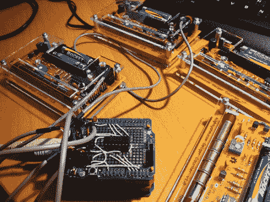

# 用辐射制作音乐

> 原文：<https://hackaday.com/2012/05/25/making-music-with-radiation/>

来自 mightyohm.com 的杰夫·凯撒有机会展示这一有趣的环境音乐。他在用他的盖革计数器检测β和γ辐射。然后，这将向 Arduino 发送一个脉冲，将其转换为音符。盖革计数器输出 1.ms 的 3v 脉冲，所以他首先要通过 74Ls04，它会输出 arduino 想要的 5V 电压。他不可否认不是音乐家，但你可以在视频中听到它听起来不错。尤其是考虑到他们都只是不同八度的 C。我们这些音乐家可能会选择 B#。

环境噪音很有趣，但是当你意识到它是由放射性衰变引起的，它不知何故变得更受关注。我们经常忘记我们周围看不见的世界。他甚至往盖革计数器上扔了几颗铀弹珠来增加趣味。

[https://www.youtube.com/embed/Q_3SVE0CQqw?version=3&rel=1&showsearch=0&showinfo=1&iv_load_policy=1&fs=1&hl=en-US&autohide=2&wmode=transparent](https://www.youtube.com/embed/Q_3SVE0CQqw?version=3&rel=1&showsearch=0&showinfo=1&iv_load_policy=1&fs=1&hl=en-US&autohide=2&wmode=transparent)