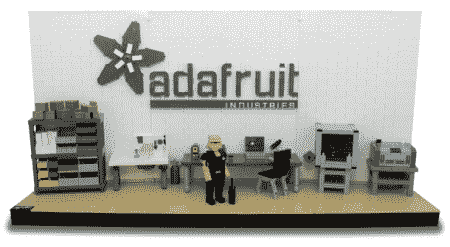

# 女生用乐高？[Limor]有些想法。

> 原文：<https://hackaday.com/2012/05/25/legos-for-girls-limur-has-some-ideas/>

当乐高宣布他们要做一个“女孩的乐高”系列的时候，我们很多人都没有明白。当我们还是孩子的时候(滚出我的草坪！)，乐高是完全无性的。至少，作为一个白人男性，我的脑海里是这么看他们的。虽然这个想法本身在市场营销方面有意义，但他们推出的产品却牢牢地停留在相同的旧性别角色上。粉红色比比皆是，鲜花盛行。小女孩喜欢这些东西并没有错，但当这是唯一的选择时，就令人难过了。为了进行比较，我不喜欢运动，我可以告诉你，科学榜样的存在让我在人生的许多艰难时期保持理智。

[Limor]，你可能会认为他是 Adafruit [的幕后策划者，他提出了你在上面看到的一套方案，提出了另一种选择](http://lego.cuusoo.com/ideas/view/17491)。他们已经把这个场景放到了乐高库苏网站上，如果获得足够多的投票，它就可以成为一个真正的产品。这是另一个[女性乐高套装](http://lego.cuusoo.com/ideas/view/15401)的好主意，展示了现实中的女性角色，比如化学家和考古学家。我有点惊讶，我没有在名单上看到[阿米莉亚·埃尔哈特]或[阿达·洛芙莱斯]本人。

撇开性别角色不谈，谁将为我们打造最终的[尼古拉·特斯拉]套件？