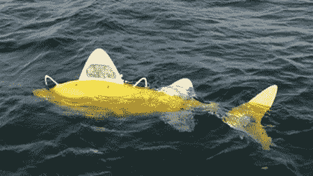

# 机器鱼检测污染物

> 原文：<https://hackaday.com/2012/05/26/robot-fish-detect-pollutants/>

如果你碰巧参观西班牙的希洪港，你可能会注意到一些巨大的黄色机器鱼在游来游去。这些 5 英尺长的游泳者是被提议用来检测水中污染物的传感器网络的一部分。这种鱼配备了一系列传感器，可以测试一般的水质，或者更换传感器进行特定的测试。它们相互通信，以避免偏离网络的其余部分和基本充电站太远。

这种鱼是由 Shoal Consortium 设计的，这是一个欧洲委员会资助的项目，吸引了欧洲各地大学的聪明才智。虽然现在这种鱼的价格超过 35，000 美元，但大规模生产应该会大大降低成本。

你可以在 BBC 的视频链接中看到它们游来游去。