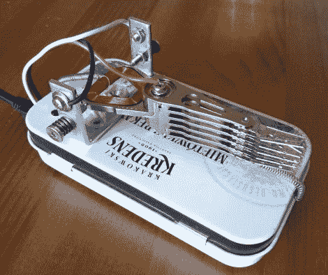

# 微调你的莫尔斯电码技能与这个薄荷锡实践键控器

> 原文：<https://hackaday.com/2012/05/28/fine-tune-your-morse-code-skills-with-this-mint-tin-practice-keyer/>

Hackaday reader [svofski]撰文分享了他制作的一个设备，这对任何试图磨练其 CW 技能的业余爱好者来说都是有用的。他称他的练习钥匙为 Morseshnik，它是在翻他的零件抽屉时发现的各种物品的组合。

他拆卸了一个旧硬盘，保留了它的读臂作为键盘的拨片。他购买了一些小尖括号来为设备创建一组触点，杠杆位于触点之间，通过一对弹簧自动居中。

一个 MSP430 也在[svofski 的]垃圾堆里收集灰尘，它位于一个小型 DIY PCB 上的 Morseshnik 的薄荷罐底座内。它允许他在练习 dits 和 dahs 的时候，轻轻一按开关就可以在手动和自动键控模式之间切换。

请继续阅读，观看 Morseshnik 的视频短片，如果您想自己制作一个，请访问他的网站，获取代码和 PCB 原理图。

[https://www.youtube.com/embed/cbtNn3pxcic?version=3&rel=1&showsearch=0&showinfo=1&iv_load_policy=1&fs=1&hl=en-US&autohide=2&wmode=transparent](https://www.youtube.com/embed/cbtNn3pxcic?version=3&rel=1&showsearch=0&showinfo=1&iv_load_policy=1&fs=1&hl=en-US&autohide=2&wmode=transparent)