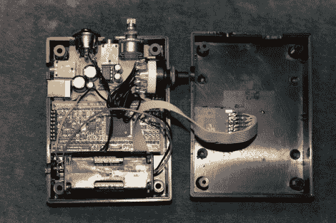

# 一个可以放在口袋里的样品播放器

> 原文：<https://hackaday.com/2012/05/29/a-sample-player-you-can-slip-in-your-pocket/>

这款便携式样品播放器功能强大。[Lee]想要一种便携的方式来随身携带他的样品，但拒绝仅仅因为它是便携的就降低其功能。他设定的目标是从存储的大量样本中同时弹奏 3-8 个音符。

样本空间是第一个设计考虑因素，很难击败 SD 卡的每兆字节价格。经过一些计算后，他得出结论，可以足够快地从卡上提取这些样本，以实现 CD 质量频率的同步音符目标，但前提是从卡上读取时只有很少或没有延迟。这意味着[Lee]需要一个快速的处理器，所以他选择了 LPC1769，这是一个 ARM Cortex-M3 处理器，可以运行在 120 MHz。

项目盒包括一个音量旋钮的空间，以控制内置耳机放大器的输出。还有一个旋转编码器用于选择样本集。但我们对这部分有点困惑，因为该设备是 MIDI 控制的。[Lee]是电子 Moolodeon 的创造者，它本身有 MIDI 输出，将被用作这个项目的控制器。