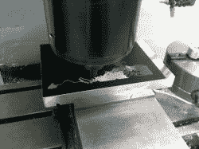
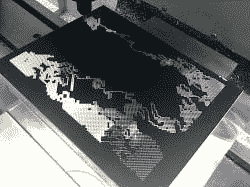
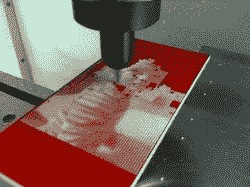

# 黑客日链接:2012 年 5 月 29 日

> 原文：<https://hackaday.com/2012/05/29/hackaday-links-may-29-2012/>

#### Teensy CNC mill

Inventables 的伙计们组装了一个看起来非常有趣的整洁的 CNC 路由器套件。它使用 Makerslide 直线轴承和 CNC 零件来制作一个出奇便宜的框架，用于雕刻木头和金属。Inventables 正在进行 Kickstarter 式的预购，为这次生产提供资金，但目前他们还缺少 30 份订单。我们希望看到这些路由器在现实世界中的表现，所以如果你还在观望(或者只是想要一台数控路由器)，这可能是购买的时候了。

#### DIY 焊烟提取器

[贾里德]送来了一台他组装的抽油烟机。这是一个小型电脑机箱风扇，一个碳过滤器夹在一对格栅之间。不多，但应该让那些奇妙的焊剂烟雾远离你的脸。

#### 一百万个假互联网指向第一个提出 DIY 克隆的人

[文件空间]与我们分享了一个[令人敬畏的电子捕鱼视频](http://www.youtube.com/watch?v=ySHsrOSERgY&feature=youtu.be)。[电捕鱼](http://en.wikipedia.org/wiki/Electrofishing)通过连接在船上的两个电极产生 DC 电流脉冲。这种电流导致鱼类趋电，使它们向阳极游去。鱼可以用网捕捉，事后放生；对鱼没有任何伤害。我们很想看到一个 DIY 的解决方案，但是*把 M-80 扔进湖里不算。*

#### 用一点金属改善 GSM 接收

[Raivis]住在乡下，所以连他在 GSM 上的语音接收都很差，更别说数据了。受早先一篇帖子的启发，[Raivis]给[造了一个盘锥天线](http://www.rrkb.lv/musings/?p=74)来改善他的手机信号。现在一切都很清楚了，他的华为 E1752 USB/GSM 调制解调器从 3 mbps 下降到 5 mbps。

#### CNC 半色调照片

#### 

[Dana]发了几张他正在做的项目的照片。他正在用电脑和金属制作半色调印刷品。我们在之前已经[见过这种情况，但我们真的很喜欢[Dana]的观点。他在 CNC 上使用带有 0.005 英寸雕刻工具的双层雕刻塑料。休息之后有一个他作品的画廊；[Dana]的肖像是 14000+点，花了 6 个小时，他老板的孩子是 16000+点，花了 4 个小时，而[Dana]的侄女是 5500 点，花了 35 分钟。非常棒的工作，现在[Dana]实现了一生的梦想，加工他的脸。](http://hackaday.com/2011/07/28/creating-halftone-pictures-with-a-cnc-machine/)

