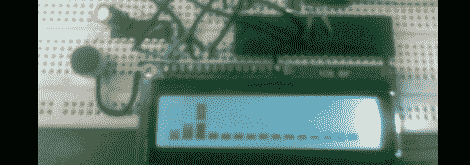

# 用微控制器制作音频频谱分析仪

> 原文：<https://hackaday.com/2012/05/29/making-an-audio-spectrum-analyzer-with-a-microcontroller/>

虽然[Vinod]说他不是这方面的专家，但我们真的很喜欢他的[音频频谱分析仪](http://blog.vinu.co.in/2012/05/implementing-discrete-fourier-transform.html)由一个简单的微控制器和 LCD 显示器构建而成。

一个经过充分研究的事实是，每个音频波形——例如，你的声音记录——只是许多许多正弦波的总和。这些正弦波可以通过[傅立叶分析](http://en.wikipedia.org/wiki/Fourier_analysis)和[离散傅立叶变换](http://en.wikipedia.org/wiki/Discrete_Fourier_transform)提取出来。这是频谱分析仪工作的原理；[Vinod]写了一点代码，使用 DFT 分解从麦克风捕获的音频，并在 LCD 显示器上输出它们的频率。

为了在他的 LCD 上输出光谱，[Vinod]在他的显示器上将水平条堆叠成 8 个自定义字符。就像[Vinod]之前在 ATMega32 实验上的[音频一样，一个 LM324 放大器通过一个模拟引脚连接到 ATMega。[Vinod]用他的频谱分析仪做了一个非常聪明的模型，并且很好地回答了我们经常被问到的“我如何构建一个吉他调音师”的问题。](http://blog.vinu.co.in/2012/05/generating-audio-echo-using-atmega32.html)

休息之后，你可以看到[Vinod]的频谱分析仪在工作。被预先警告；你可能想调低音量。

[https://www.youtube.com/embed/IUYPmN5fJhY?version=3&rel=1&showsearch=0&showinfo=1&iv_load_policy=1&fs=1&hl=en-US&autohide=2&wmode=transparent](https://www.youtube.com/embed/IUYPmN5fJhY?version=3&rel=1&showsearch=0&showinfo=1&iv_load_policy=1&fs=1&hl=en-US&autohide=2&wmode=transparent)