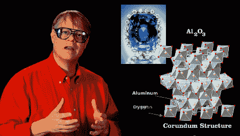

# 阳极氧化如何被用来制作漂亮的 IPod 颜色

> 原文：<https://hackaday.com/2012/05/29/how-anodization-is-used-to-make-pretty-ipod-colors/>

那些五颜六色的 iPod Nano 保护套和蓝宝石有什么共同点？在这两种物质中，颜色不在表面，而是整合在材料的结构中。像往常一样，[比尔·哈马克] [在他的最新一集《工程师盖伊》中揭示了通过阳极氧化给金属着色背后的有趣概念。](http://www.youtube.com/watch?v=3ZhVOy-ytJY)

我们对阳极氧化过程并不陌生。事实上，我们已经看到它在家里被用来改变钛野营用具的颜色。[Bill]解释了电化学过程的实际情况；触及我们已经知道的事实；就像电压范围会影响阳极氧化表面的颜色。但他继续解释为什么这些表面是不同的颜色，然后概述了阳极氧化金属如何染色。没错，那些 iPod 外壳是用染料上色的，洗不掉也刮不掉。

当铝经过阳极氧化时，孔隙被打开。这些小孔被染料填满，然后将金属放入水中煮沸，封闭小孔，将颜色封闭。相当整洁！

[https://www.youtube.com/embed/3ZhVOy-ytJY?version=3&rel=1&showsearch=0&showinfo=1&iv_load_policy=1&fs=1&hl=en-US&autohide=2&wmode=transparent](https://www.youtube.com/embed/3ZhVOy-ytJY?version=3&rel=1&showsearch=0&showinfo=1&iv_load_policy=1&fs=1&hl=en-US&autohide=2&wmode=transparent)