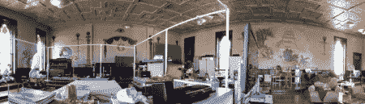

# 黑客空间游戏攻略:佐治亚州罗马的 7 座山

> 原文：<https://hackaday.com/2012/05/30/hackerspace-introduction-7hills-makerspace-in-rome-georgia/>

这个地方强烈提醒我们，并非所有的黑客空间都是一样的。坐落在共济会寺庙里，7hills makerspace 与众不同。他们是相当新的，刚刚在一月份建成的位置。我没有计划参观，只是碰巧足够幸运地看到[约翰·格劳特]在那里做丝网印刷。他同意当场带我们参观，我认为他做了一件了不起的工作。

[https://www.youtube.com/embed/T0Zaz6Zvx7s?version=3&rel=1&showsearch=0&showinfo=1&iv_load_policy=1&fs=1&hl=en-US&autohide=2&wmode=transparent](https://www.youtube.com/embed/T0Zaz6Zvx7s?version=3&rel=1&showsearch=0&showinfo=1&iv_load_policy=1&fs=1&hl=en-US&autohide=2&wmode=transparent)

除了更杂乱和更大的制造工具，这个空间有你能想到的大多数东西。他们有 3d 打印，一个音乐编辑站，视频编辑站，电子站，一个休息室，电子实验室，丝网印刷和乙烯基切割设备，以及更多我甚至不记得的东西。虽然他们可能没有全尺寸的车床或焊接/研磨设备，但有一个台锯和一些其他设备藏在大厅外面。你还可以从当地学校的机器人项目中一窥机器人竞技场。

[John]向我们展示了一些对我来说是新的想法，但是非常好的想法。他们有一个项目，他们称之为“你好，制作世界”。它是一种手电筒，涉及制作定制电路板，焊接，3d 打印外壳，以及激光切割和雕刻外壳的侧面。这为您介绍了该领域的许多流程。

[https://www.youtube.com/embed/tnHa5kBtiF4?version=3&rel=1&showsearch=0&showinfo=1&iv_load_policy=1&fs=1&hl=en-US&autohide=2&wmode=transparent](https://www.youtube.com/embed/tnHa5kBtiF4?version=3&rel=1&showsearch=0&showinfo=1&iv_load_policy=1&fs=1&hl=en-US&autohide=2&wmode=transparent)

[约翰]在那里有一个项目，他愿意给我们看。这是一个卫生系统，它可以确保人们在进入或离开医院房间之前洗手。这是一个我们在之前[实际上已经看到的主题，因为它是一个普遍关注的问题。](http://hackaday.com/2011/04/05/hacking-automated-hand-sanitizers-with-ben-heck)