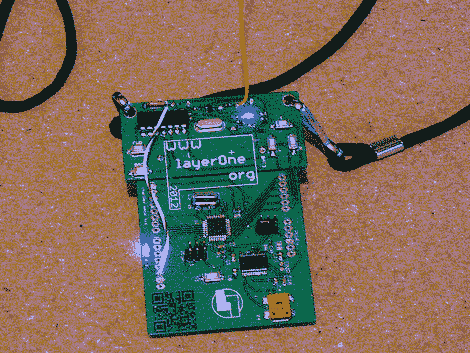

# 莫尔斯电码信标赢得 LayerOne 徽章黑客大赛

> 原文：<https://hackaday.com/2012/05/30/morse-code-beacon-wins-the-layerone-badge-hacking-contest/>

火腿技能在今年的 LayerOne 徽章黑客大赛中盛行。[杰森]是这次莫尔斯电码破解的赢家。在看到[我们关于徽章硬件开发的预览功能](http://hackaday.com/2012/05/24/layerone-badges-stop-bullets-drive-away/)后，他在竞争中领先了一步。这让他开始思考，并让他在到达之前收拾好工具。

硬件被分成两部分。下半部分是对 Arduino 的模仿，上半部分是一个无线发射器，用来控制一些便宜的遥控汽车。[杰森]认为这是完美的转换为连续波信标(连续波是什么莫尔斯电码被称为如果你是一个火腿)。他遇到的第一个问题是让徽章很好地与 Arduino IDE 兼容。它被设置为运行使用内部振荡器的 Slowduino 固件。[Jason]焊接在他自己的晶体上并刷新了固件。他发现发射器不能直接键控，因为遥控汽车协议中使用了移位。他切断了发送器的电源，并发现通过向其他引脚中的一个注入电源可以更准确地键入。休息之后，请观看视频，以更好地了解他的技术。

[https://www.youtube.com/embed/rcdzskBYPck?version=3&rel=1&showsearch=0&showinfo=1&iv_load_policy=1&fs=1&hl=en-US&autohide=2&wmode=transparent](https://www.youtube.com/embed/rcdzskBYPck?version=3&rel=1&showsearch=0&showinfo=1&iv_load_policy=1&fs=1&hl=en-US&autohide=2&wmode=transparent)