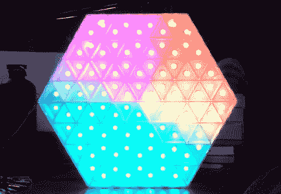

# 三角形网格 LED 显示屏

> 原文：<https://hackaday.com/2012/05/31/triangle-grid-led-display/>

[Dearmash]将这个 [RGB LED 显示屏组装在一起，每个像素使用三角形](http://www.reddit.com/r/arduino/comments/ube6j/showntell_finished_my_obsession_a_trianglebased/)。这是对传统网格布局的有趣偏离。休息之后有两个视频演示。第一种是在加工过程中产生的等离子体样式的图案。第二个是一个旋转色轮，如果和你的 Photoshop 颜色微调器同步的话就完美了。

因此，物理构建已经完成，现在[Dearmash]正在为设备寻找用途(事情不总是这样吗？).他提到，三角形布局看起来很酷，但使得文本显示几乎不可能。有人知道如何实现这一点吗？我们马上就能看到类似于 Metallica 标志的 M 和 a 的侧滚字体，但是必须有某种方法将这些像素组合成可读的字符。如果你总是在同一行使用一个向上和向下的三角形作为一个像素，它会形成一个平行四边形，用来显示斜体字符。

[https://www.youtube.com/embed/CisIodyrUBU?version=3&rel=1&showsearch=0&showinfo=1&iv_load_policy=1&fs=1&hl=en-US&autohide=2&wmode=transparent](https://www.youtube.com/embed/CisIodyrUBU?version=3&rel=1&showsearch=0&showinfo=1&iv_load_policy=1&fs=1&hl=en-US&autohide=2&wmode=transparent)

[https://www.youtube.com/embed/Skka2JBml88?version=3&rel=1&showsearch=0&showinfo=1&iv_load_policy=1&fs=1&hl=en-US&autohide=2&wmode=transparent](https://www.youtube.com/embed/Skka2JBml88?version=3&rel=1&showsearch=0&showinfo=1&iv_load_policy=1&fs=1&hl=en-US&autohide=2&wmode=transparent)