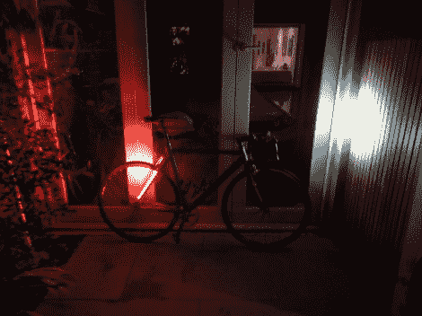

# LED 自行车黑客确保你在晚上被看到

> 原文：<https://hackaday.com/2012/05/31/led-bicycle-hack-makes-sure-youre-seen-at-night/>

我们熟悉的自行车尾灯和前灯是小型附加模块。这个想法是用一条条的发光二极管从后面保护你。它们非常明亮，与安装在车把上的一对 LED 头灯相匹配。

显然[A.Davis12]在周围放了一些 LED 灯条。没有我们习惯看到的东西，但它们有相似的足迹，所以你应该能够替代卷轴上的那种，可能会被切成一定长度。大部分建造时间都花在了将灯和它们的控制线与自行车的框架整合上。框架上已经有孔，用于在管道内给刹车和换档的控制线馈电。这听起来很痛苦，但最终他设法完成了所有的布线工作。两条红色的带子用拉链系在座位撑杆的后面。它们由安装在车座背面下方的项目箱内的锂电池供电。箱子上的翻转开关让你可以不停地打开它们。

[谢谢阿帕德]