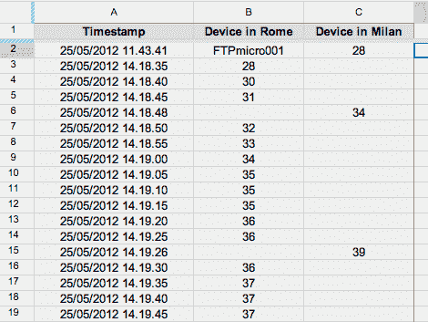

# 数据直接记录到谷歌文档(谷歌驱动)

> 原文：<https://hackaday.com/2012/05/31/data-logging-directly-to-google-docs-google-drive/>

【伊曼纽】正在[使用谷歌文档自动记录他的温度传感器数据](http://it.emcelettronica.com/inviare-dati-google-doc-spreadsheets-con-picmicro-ftpmicro-temperature-monitor) ( [翻译](http://translate.google.com/translate?sl=auto&tl=en&js=n&prev=_t&hl=en&ie=UTF-8&layout=2&eotf=1&u=http%3A%2F%2Fit.emcelettronica.com%2Finviare-dati-google-doc-spreadsheets-con-picmicro-ftpmicro-temperature-monitor))。我们可以看到使用该系统的一些好处。一个是你不必访问登录硬件的网站来获取数据，另一个是谷歌会自动为你绘制数据。当然，这意味着你需要某种方式将你的日志连接到互联网上，但是我们已经看到了很多不同的技术。在这种情况下，[伊曼纽]使用的 PIC 硬件板上有一个网卡。但是这项技术可以在计算机上像在微控制器上一样容易地使用。

黑客的核心是嗅出 HTTP 头和语法，以便写入 Google Docs(即将成为 Google Drive)电子表格的单元格。在制作了一个新的电子表格并从地址栏中复制了 URL 和键之后，他使用 header-viewer web 服务加载页面。掌握了所有相关信息后，他编写了大约十几行代码来组装 HTTP 数据包，并动态地将时间戳和温度读数放入其中。休息之后，请观看系统运行情况。

[https://player.vimeo.com/video/42838809](https://player.vimeo.com/video/42838809)