# 黑客空间简介:佐治亚州亚特兰大的 Freeside 黑客空间

> 原文：<https://hackaday.com/2012/05/31/hackerspace-intros-freeside-hackerspace-in-atlanta-georgia/>

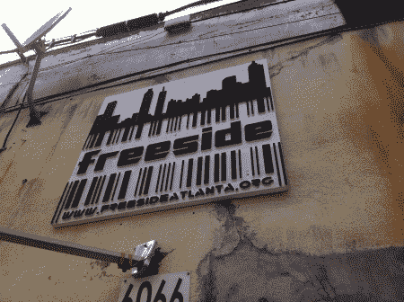

当我宣布我将在今年夏天穿越东南部的一些地区时，来自亚特兰大自由城的 Slade 给我发了一封电子邮件，让我在他们的黑客空间停留一下。我很高兴他也这么做了，因为这个地方真的很酷。[史蒂文·萨顿]同意带我们参观工厂，作为导游，他做得很好。

[https://www.youtube.com/embed/GJGj70FQ0bk?version=3&rel=1&showsearch=0&showinfo=1&iv_load_policy=1&fs=1&hl=en-US&autohide=2&wmode=transparent](https://www.youtube.com/embed/GJGj70FQ0bk?version=3&rel=1&showsearch=0&showinfo=1&iv_load_policy=1&fs=1&hl=en-US&autohide=2&wmode=transparent)

Freeside Hackerspace 是一个 5500 平方英尺的设施，感觉就像是在不停地运转。迎接我们的是一个干净整洁的工作区，里面有 3d 打印机、协作空间、电子工作站、教室和项目仓库。当我们进一步向后移动时，我们发现酒吧和休息区配有 kegerator、巨型 cnc 切割翼龙、投影系统和几个看起来很舒适的沙发。

穿过一对标有“车间”的门后，迎接我们的是一个更适合制造的区域，里面摆满了车床、工作台、所有你能想象到的电动工具，甚至还有两个汽车间。如果你心中有一个项目，他们有空间和工具来实现它。

[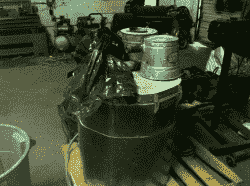](https://hackaday.com/wp-content/uploads/2012/05/img_2418.jpg)[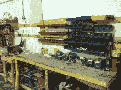](https://hackaday.com/wp-content/uploads/2012/05/img_2422.jpg)[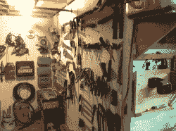](https://hackaday.com/wp-content/uploads/2012/05/img_2424.jpg)[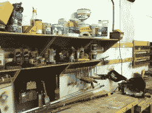](https://hackaday.com/wp-content/uploads/2012/05/img_2425.jpg)[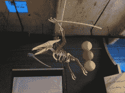](https://hackaday.com/wp-content/uploads/2012/05/img_2428.jpg)[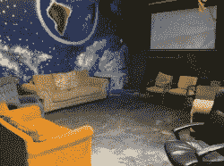](https://hackaday.com/wp-content/uploads/2012/05/img_2429.jpg)[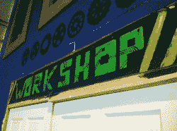](https://hackaday.com/wp-content/uploads/2012/05/img_2432.jpg)[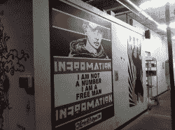](https://hackaday.com/wp-content/uploads/2012/05/img_2433.jpg)[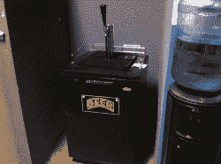](https://hackaday.com/wp-content/uploads/2012/05/img_2434.jpg)[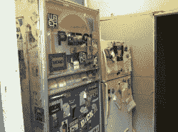](https://hackaday.com/wp-content/uploads/2012/05/img_2435.jpg)[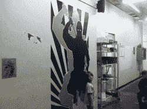](https://hackaday.com/wp-content/uploads/2012/05/img_2436.jpg)[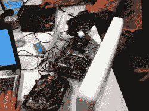](https://hackaday.com/wp-content/uploads/2012/05/img_2437.jpg)[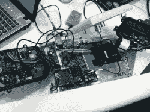](https://hackaday.com/wp-content/uploads/2012/05/img_2438.jpg)[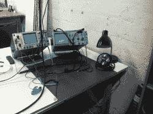](https://hackaday.com/wp-content/uploads/2012/05/img_2439.jpg)[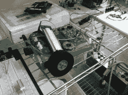](https://hackaday.com/wp-content/uploads/2012/05/img_2440.jpg)[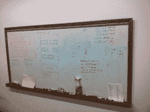](https://hackaday.com/wp-content/uploads/2012/05/img_2442.jpg)[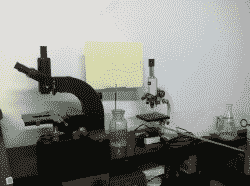](https://hackaday.com/wp-content/uploads/2012/05/img_2443.jpg)[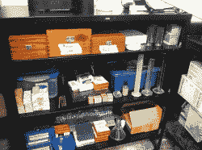](https://hackaday.com/wp-content/uploads/2012/05/img_2444.jpg)[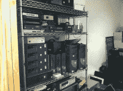](https://hackaday.com/wp-content/uploads/2012/05/img_2445.jpg)[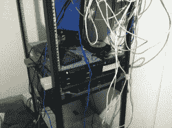](https://hackaday.com/wp-content/uploads/2012/05/img_2446.jpg)[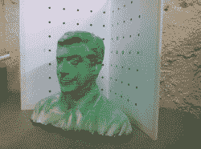](https://hackaday.com/wp-content/uploads/2012/05/img_2447.jpg)[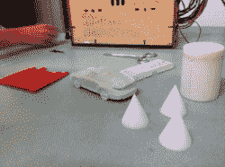](https://hackaday.com/wp-content/uploads/2012/05/img_2448.jpg)[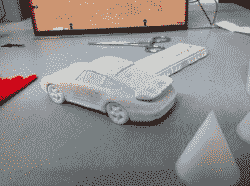](https://hackaday.com/wp-content/uploads/2012/05/img_2449.jpg)[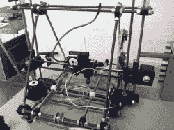](https://hackaday.com/wp-content/uploads/2012/05/img_2450.jpg)[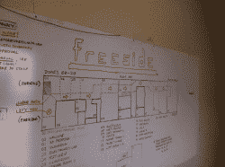](https://hackaday.com/wp-content/uploads/2012/05/img_2451.jpg)

我仍然在南卡罗来纳州，如果他们遇到我们，我会很乐意访问更多的黑客空间。如果你知道我们回去的路上有一个。让我知道。我们目前在南卡罗莱纳州的希尔顿黑德，但我们的回程将带我们去南卡罗莱纳州的 Beufort。然后，在我们最终回家之前，我们将经过北卡罗来纳州富兰克林、田纳西州查塔努加、田纳西州纳什维尔和肯塔基州帕杜查。