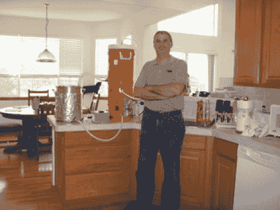

# 为您的厨房柜台酿造的全谷物一体机

> 原文：<https://hackaday.com/2012/05/31/all-in-one-all-grain-brewing-for-your-kitchen-counter/>

全谷物酿造是一项劳动和设备密集型的努力，但与部分糖化或提取酿造相比，它能生产出最高质量的啤酒。[杰夫·卡尔平斯基]开始采用后两种方法，但随着他对这一爱好的热情高涨，他发现自己只用一个电水壶就能酿造全谷物批次。他开发了上面提到的系统[，这是一种自动化所有谷物加工过程的简单方法](http://www.byo.com/stories/issue/article/issues/266-november-2009/1987-countertop-brewing-system)，而且他设法让它足够整洁，可以在厨房里做。

全谷物酿造通常涉及五或十加仑(或更多)煮沸。这种量通常是要求酿造过程移出厨房的量。但是因为杰夫是房子里唯一喝啤酒的人，他把每次喝的啤酒限制在三加仑。这意味着所有的设备占用更少的空间。这里，他在柜台的一小块地方放了一个 5 加仑的桶、冷却器和水壶。在水壶和水桶之间，你可以看到他制作的控制器盒。这负责将电源切换到冲泡壶中的加热元件和桶中的电动泵。桶里有一个固定的逆流冷却器，可以在加入酵母之前将麦芽汁降低到合适的温度。这是非常令人惊讶的液体是如何包含从开始到结束！

[Thanks ScottInNH]