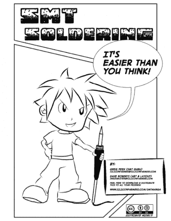

# SMD 漫画指南

> 原文：<https://hackaday.com/2012/06/02/manga-guide-to-smd/>

对于那些在接近 SMD 时总是感觉有点胆怯的人，你可以放松了。这里有一个[简单的指南，带你走过进入表面贴装器件](http://www.siliconfarmers.com/smtmanga/)的第一步。根据创意通用许可证免费分发，SMD 漫画指南是一个 18 页的漫画，其目标是让我们所有人都成为 SMD 制作人。有一个很好的视觉解释什么是 SMT，为什么我们使用它，以及如何通过你的烙铁焊接微小的设备彻底走过。在本期中，他们不会讨论小型回流焊炉。

如果这很符合你的学习风格，你可能也会对漫画《电学指南》感兴趣。