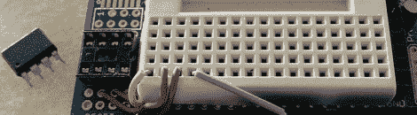

# 黑客日链接:2012 年 6 月 3 日

> 原文：<https://hackaday.com/2012/06/03/hackaday-links-june-3-2012/>

#### 当猪飞的时候…够近了。

关于这一点，有太多的笑话可以开了。这是用一只死猫做成的[四轴飞行器。这背后的艺术家叫他奥维尔。他死于自然原因，还有什么更好的方式来纪念一位喜欢追鸟的猫朋友呢？](http://io9.com/5915156/this-quadcopter-is-made-from-a-taxidermied-cat)

#### 翻新一个苹果]

你父母阁楼上那台三十年的旧电脑不会自己清理干净，是吗？[Todd]上传了一系列视频，拆除了 1982 年的苹果[[plus](http://www.toddfun.com/2012/05/28/apple-ii-plus-from-1982-teardown-repair-cleanup-and-demonstration/)，清理了沿途的一切，并做了一个非常好的 AppleSoft BASIC 演示。伙计们，这是革命开始的地方。

#### 欧姆甜ω嗯

十字绣不再是祖母的专利了。阿达果贴了一个[十字绣教程](http://ladyada.net/make/xstitch/)和他们的[电阻色码十字绣套件](http://adafruit.com/products/855)。现在到业余爱好大厅去找黑色十字绣布和制作“ol skull”n 扳手。

#### 欢迎光临！回到昨天的世界！

Boing Boing 发现了一张惊人的赛博朋克照片，这张照片出现在 1992 年或 1993 年的 Mondo 2000 杂志上。即使记住这是一个自我模仿，这仍然是不可思议的。黑客有激光笔？还有传呼机？

#### 缩小 Arduino 项目

[Scott]发现了缩小 Arduino 项目的方法，所以他把 Arduino 原型板变成了 ATtiny85 程序员的[。另外，[Scott]可以使用附带的试验板在 85 年前后搭建电路。](http://www.startgroup.org/portfolio/attiny85-proto-shield/)