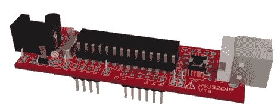

# 这不是真实的:逼真的渲染从鹰文件

> 原文：<https://hackaday.com/2012/06/05/this-is-not-real-lifelike-renderings-from-eagle-files/>

看着它。看看就知道了！这块板子是个谎言。它不存在(至少不是这里的图像中所看到的)。相反，这是由 Eagle CAD 文件制作的逼真渲染图。

我们已经看到，由于 EagleUp 包，将 Eagle CAD 文件导入 Google SketchUp [变得相当容易。你会得到一个看起来很不错的 3D 模型，但它几乎不像照片那样真实。这个过程以完全相同的方式开始。但是你需要再处理一次 SketchUp 文件。](http://hackaday.com/2011/11/16/eagleup-pulls-your-pcbs-into-sketchup/)

一个叫做 Kerkythea 的程序会帮你做到这一点。这是一个开源项目，旨在产生逼真的渲染。它有一个插件，可以处理任何 SketchUp 模型，并应用上图中看起来如此美妙的纹理和阴影。这不是一次点击的过程，而是提醒我们在 Blender3D 这样的程序中可以找到大量的选项。你需要为你想要映射的每一个不同的材质绘制设置，但是在上面的链接中找到的指南很好的展示了它是如何完成的。