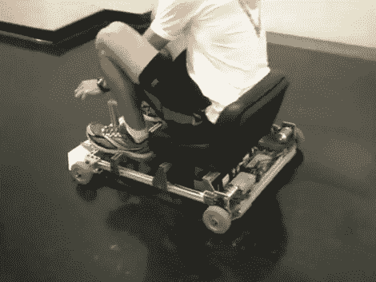

# 奇比卡特:一步一步让你建立自己的小轮赛车

> 原文：<https://hackaday.com/2012/06/05/chibikart-step-by-step-lets-you-build-your-own-tiny-wheel-racer/>

[cHaRlEsg]发布了[一个咆哮](http://www.etotheipiplusone.net/?p=1998)，然后发布了关于[如何为自己建造这个电动卡丁车的完整说明](http://www.instructables.com/id/Chibikart-Rapid-Prototyping-a-Subminiature-Electr/)。

现在，狂言者称之为“奇比卡特”的“不含铌的兄弟”。我们很遗憾地报告，他所说的 unobtainium 是超级棒的[手动缠绕轮毂电机，它为最初的卡丁车](http://hackaday.com/2012/05/01/drop-everything-and-build-this-go-kart-right-now/)提供动力，让我们在第一次看到它后目瞪口呆。但是看，很少有人有必要的技能和工具来制造这些现代工程的圆形奇迹。

所以你只需要满足于你能买到的东西来组装这里看到的小卡丁车。它是全电动的，使用两个 DC 发动机为后轮提供动力。休息过后，你可以在视频中看到它在走廊里奔跑。我们唯一能看到的等式中缺少的东西(除了红色外壳之类的)是头盔和保险杠(你会在剪辑的最后看到原因)。

[https://www.youtube.com/embed/QbR9QrC370o?version=3&rel=1&showsearch=0&showinfo=1&iv_load_policy=1&fs=1&hl=en-US&autohide=2&wmode=transparent](https://www.youtube.com/embed/QbR9QrC370o?version=3&rel=1&showsearch=0&showinfo=1&iv_load_policy=1&fs=1&hl=en-US&autohide=2&wmode=transparent)