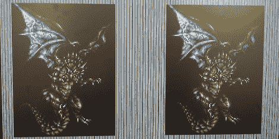

# 开源显卡

> 原文：<https://hackaday.com/2012/06/05/open-source-graphics-card/>

尽管 NVidia 和 ATI 已经开源了一段时间，但仍然没有真正的开源显卡。[Anton]和[Per]试图通过围绕 FPGA 构建自己的显卡来解决这个问题。这个项目[叫做 ORSoC](http://opencores.com/project,orsoc_graphics_accelerator) ，可以在 opencores.com 上下载。

这些家伙正在围绕一个数字 at Lys FPGA 开发板构建 ORSoC 显卡。到目前为止，他可以绘制线条、纹理三角形、位图或矢量字体，并在屏幕上显示一些 3D 网格。这个项目并不打算在 Linux 上运行高级 OpenGL 或 Steam，但对于这个图形加速器的所有工作来说，这是一个令人惊叹的工作。

休息之后有几个演示；一个三维旋转的立方体和一个演示绘图和转换多边形和一些纹理。ORSoC 有点慢，但这是因为构建没有针对团队使用的 FPGA 进行优化。如果你想测试这个显卡，有一个 Git 可用。作为奖励，你甚至不需要一个 FPGA 来玩这个项目。还有所有功能的软件模拟。非常整洁。

[https://www.youtube.com/embed/qiielWxDH24?version=3&rel=1&showsearch=0&showinfo=1&iv_load_policy=1&fs=1&hl=en-US&autohide=2&wmode=transparent](https://www.youtube.com/embed/qiielWxDH24?version=3&rel=1&showsearch=0&showinfo=1&iv_load_policy=1&fs=1&hl=en-US&autohide=2&wmode=transparent)
[https://www.youtube.com/embed/_0b91_pnmSs?version=3&rel=1&showsearch=0&showinfo=1&iv_load_policy=1&fs=1&hl=en-US&autohide=2&wmode=transparent](https://www.youtube.com/embed/_0b91_pnmSs?version=3&rel=1&showsearch=0&showinfo=1&iv_load_policy=1&fs=1&hl=en-US&autohide=2&wmode=transparent)