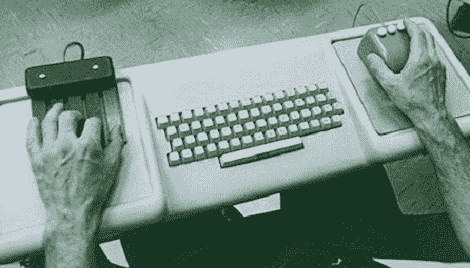

# Retrotechtacular:所有技术演示之母

> 原文：<https://hackaday.com/2012/06/05/retrotechtacular-the-mother-of-all-tech-demos/>

我们今天认为理所当然的计算机的大多数部件——鼠标、超文本、视频会议和文字处理——都是由斯坦福大学的一个研究小组在 60 年代末发明的。当操作背后的大脑[Douglas Engelbart]向 1000 名计算机研究人员展示这一点时，这个演示被称为所有演示之母。幸运的是，你可以在 YouTube 上查看这个演示的全部内容。

尽管[Englebart]的演示在今天看起来非常过时，但在当时却是革命性的。这是第一次展示计算机鼠标(旁注:他们称光标为“bug”)、和弦键盘和许多其他我们今天认为理所当然的技术。在演示过程中，[Englebart]通过距离斯坦福 30 英里的[在线系统](http://en.wikipedia.org/wiki/NLS_(computer_system))连接到[SDS 940](http://en.wikipedia.org/wiki/SDS_940)计算机。是的，这个前阿帕网，通常被称为互联网的前身。

Sadly, most of [Englebart]’s researchers became disillusioned with the time sharing /mainframe paradigm shown in this demo. Those researchers wanted a more decentralized means of computing, so they went off to Xerox PARC where they helped create the first personal computers. Still, most of the ideas from 1968, such as the mouse, hypertext, and word processing, were in those little Xerox boxes.

更具哲学意味的是，[Englebart]以这样一个问题开始了他的演示，“如果在你的办公室里，作为一名脑力劳动者，你有一台电脑显示器，由一台整天为你工作并对你的每一个动作做出即时反应的电脑支持，你能从中获得多少价值？”在这个所有演示之母诞生后的 44 年里，我们已经有了一台整天放在办公桌上的电脑，它能够完成任何可以想象的任务，它确实提高了我们的生活质量。

有一些很棒的资源涵盖了所有演示的母体，包括道格拉斯·恩格尔巴特研究所的历史页面和 T2 的斯坦福鼠标网站。回顾过去，令人惊讶的不仅是我们已经走了多远，而且实际上变化是如此之小。