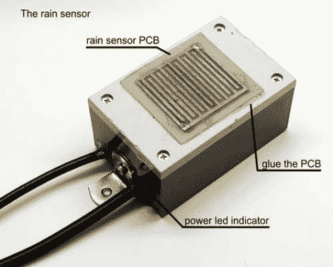

# 可视雨水传感器—因此您永远不必向外看

> 原文：<https://hackaday.com/2012/06/06/visual-rain-sensor-so-you-never-have-to-look-outside/>

现在你不用离开你的男/女洞穴就可以[知道外面的雨下得有多大。上图是[Frapedia]称之为视觉雨水传感器的传感器部分。](http://www.instructables.com/id/Visual-rain-sensor)

大多数雨量计只是用一个量筒来收集从天空落下的水。这将给你一个相当准确的测量降雨量的方法，但是它不能告诉你雨下得有多大。这里的测量是基于声音的。雨下得越大，水击打向上翻转的金属碗发出的声音就越小。当水跨过痕迹时，上面的装置打开系统，然后麦克风被用来监控来自碗的声音。这可以通过安装在房屋内部的一列发光二极管上的 VU 计芯片来实现。

休息之后，您可以看到包含状态显示的项目框。我们说它太小了，需要用一个更大的 LED 仪表来代替。

[https://www.youtube.com/embed/moz-xQcK9iA?version=3&rel=1&showsearch=0&showinfo=1&iv_load_policy=1&fs=1&hl=en-US&autohide=2&wmode=transparent](https://www.youtube.com/embed/moz-xQcK9iA?version=3&rel=1&showsearch=0&showinfo=1&iv_load_policy=1&fs=1&hl=en-US&autohide=2&wmode=transparent)