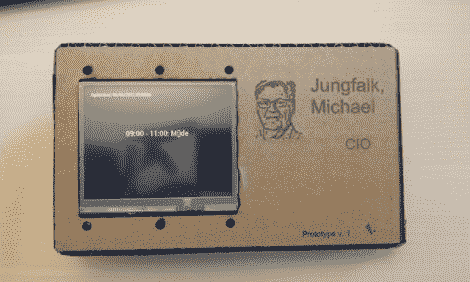

# 专横的日历告诉游客何时离开

> 原文：<https://hackaday.com/2012/06/06/bossy-calendar-tells-visitors-when-to-go-away/>

情况是这样的。你是老板，每个人都需要~~拍你的马屁~~和你谈论重要的项目细节。你需要一个接待员，或者一个有创造力的员工，他会[制作一个日历显示，让人们检查你是否有空聊天](http://technicalstuffhopefullyuseful.blogspot.dk/2012/06/physical-exchange-calendar-notification.html)。它的工作原理是在微软交换服务器上查询这个人的日程表。其中的硬件不直接处理完整的 Exchange API，而是依赖于一个服务器端脚本，该脚本根据请求向它提供信息。这是一个很好的接触，因为你可以在服务器上做很多过滤，并通过嵌入式电子设备保持简单

说到嵌入式硬件，这使用 Gadgeteer 模块。你可能不记得了，这些是[微软针对 C#和。NET](http://hackaday.com/2011/08/03/microsofts-attempt-at-an-arduino-killer-feels-like-a-gimmick/) 程序员。它使用主板，LCD，USB 主机和 Wifi 模块。这是自硬件公布以来，我们记得看到的第一个项目。

我们想知道这会不会改变老板的行为？他会开始创造性地安排时间，以便获得更多不受干扰的时间吗？