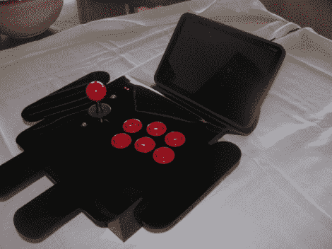

# 更新:Androcade 2.0

> 原文：<https://hackaday.com/2012/06/07/update-androcade-2-0/>

[克里斯]一直忙于自己的事业，让他的兴趣引导他前进。但是在他脑海深处一直是他的 Androcade 项目，他花了去年的时间进行改进。这是一款用于在 Android 平板电脑上玩游戏的街机控制器。它通过蓝牙连接到设备，并包括一个内置支架。

他的原始版本去年曾在这里出现过。它由木头制成(带有漂亮的 Android 绿色涂层)，包括三个按钮和一个操纵杆。这一次，他用一些黑色激光切割丙烯酸树脂制作外壳，并在按钮上折叠起来。它现在也可以列举为 HID 蓝牙设备，而以前它是通过 BT 连接推送串行数据。

朋友们对他很感兴趣，他还设计了一款全白色的 iPad。它的连接和工作方式与 Android 风格完全相同。休息之后看看大金刚的玩法。

[https://www.youtube.com/embed/-w7E6BVmFTc?version=3&rel=1&showsearch=0&showinfo=1&iv_load_policy=1&fs=1&hl=en-US&autohide=2&wmode=transparent](https://www.youtube.com/embed/-w7E6BVmFTc?version=3&rel=1&showsearch=0&showinfo=1&iv_load_policy=1&fs=1&hl=en-US&autohide=2&wmode=transparent)