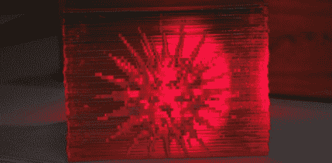

# 3D 激光切割

> 原文：<https://hackaday.com/2012/06/07/laser-cutting-in-3d/>

世界上的每个人都遭受某种程度的功能固定，倾向于只使用他们应该使用的工具。例如，激光切割机通常用于制造平面二维零件。当【探索者】决定[用激光切割机和十几块丙烯酸板](http://www.instructables.com/id/Creating-3D-Frozen-Light-art-with-Acrylic-sheets/?ALLSTEPS)创造一个发光的 3D 物体时，他打破了这种认知锁定。

[Seeker]的项目灵感来自亚克力边缘发光 LED 标牌。在这些标志中，图案被刻在丙烯酸板上，LED 从侧面照亮面板。当 LED 发出的光照射到雕刻上时，会发生折射，产生奇妙的彩色图案。

为了制作 3D 版的边缘照明显示器，[Seeker]从 Sketchup 的立方体中减去了一个病毒的 3D 模型。这就产生了一个可以折射光线的空腔。切割完 3D 立方体模型后，[Seeker]将文件发送到激光切割机，生成几十个定制面板。[Seeker]将它们粘在一起，将整个组合放在 LED 灯下，欣赏他新的激光切割 3D 病毒的美丽。