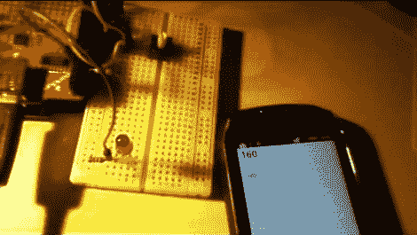

# 最简单的 SL4A 微桥示例

> 原文：<https://hackaday.com/2012/06/07/simplest-of-sl4a-microbridge-examples/>

我们熟悉筛选堆积如山的代码这一令人生畏的任务，希望你能了解一些东西是如何工作的。因此，当像 SL4A LED toggle 这样一个简单的例子出现时，我们应该感谢减少的脂肪。如果你想用 Android 设备来控制你的 Arduino 硬件，这将是一个巨大的进步。

[微桥](http://hackaday.com/2011/05/13/using-googles-adk-on-standard-arduino-hardware/)用于让 Arduino 与 Android 手机通话。它包括一个 USB 主机保护罩，让您通过 USB 电缆连接两个设备。在手机上启用 USB 调试后，您可以使用 Android 的[脚本层作为用户界面。在这种情况下，一组 Python 脚本构建了上面屏幕上看到的按钮和读数。它们还处理基于用户输入的发送和接收命令。这意味着你真的不需要了解任何关于 Android 开发的知识。我们认为这将是让你的项目通过开发阶段的一个很好的方式，你可以](http://code.google.com/p/android-scripting/)[稍后学习编写一个传统的应用](http://hackaday.com/2010/07/12/android-development-101-%E2%80%93-a-tutorial-series/)。

[https://www.youtube.com/embed/euBPivEOckY?version=3&rel=1&showsearch=0&showinfo=1&iv_load_policy=1&fs=1&hl=en-US&autohide=2&wmode=transparent](https://www.youtube.com/embed/euBPivEOckY?version=3&rel=1&showsearch=0&showinfo=1&iv_load_policy=1&fs=1&hl=en-US&autohide=2&wmode=transparent)