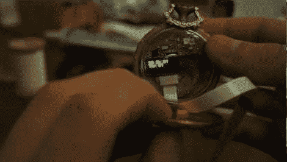

# 怀表改造采用加速度计输入

> 原文：<https://hackaday.com/2012/06/08/pocketwatch-retrofit-takes-input-from-accelerometer/>

[CNLohr]的一个朋友在一件艺术品中使用了一只旧怀表的机械装置，但把外壳留给了他。这是一个看起来很有趣的物体，拿在手中感觉很棒，所以他决定用自己的电子产品填充它，从而赋予它新的生命。他在视频中展示了硬件的早期版本，但计划很快发送另一个版本的电路板，以添加一些功能。

你可以看到，圆形 PCB 足够小，可以放入原始硬件腾出的空间。带状电缆用于连接编程器，我们认为它也是本次演示的电源。有一个小型的密度计显示器从加速度计上读出十六进制数值。许多这种 mems 芯片(你可以从这篇文章中了解它们是如何工作)包括一个硬件敲击检测器。这意味着你可以用手指在设备上轻点，芯片就会向与之相连的任何芯片发出输入信号。这是一个很好的用户输入选项，也是[CNLohr]在这里选择的选择按钮。他将手表倾斜到一边，然后点击打开 LED。目前就这些，但我们喜欢它展示的承诺，不能等待更新！

[https://www.youtube.com/embed/l2ZbOQaq5C4?version=3&rel=1&showsearch=0&showinfo=1&iv_load_policy=1&fs=1&hl=en-US&autohide=2&wmode=transparent](https://www.youtube.com/embed/l2ZbOQaq5C4?version=3&rel=1&showsearch=0&showinfo=1&iv_load_policy=1&fs=1&hl=en-US&autohide=2&wmode=transparent)