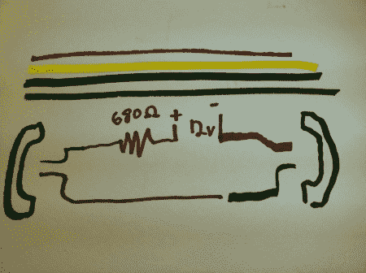

# 在你的大众汽车上(或其他任何地方)使用旧手机作为对讲机

> 原文：<https://hackaday.com/2012/06/08/using-old-phones-as-an-intercom-in-your-vw-bus-or-anywhere-else/>

如果你没有注意到我在这个问题上的许多评论，我开的是大众汽车。这是一辆 1976 年的威斯特法利亚野营车，漆着灰绿色，内饰是绿色格子。我非常喜欢它，我的家人也是如此。我们定期去乡下开车兜风和露营。我们发现，当我们以更高的速度前进时，孩子们很难与我们交流。这些东西不是世界上最安静的汽车。用一台最高功率可能达到 75 马力的发动机推动这块面包形状的钢铁，会产生风噪、发动机噪音，当然还有振动。

我决定雇佣一个非常老的黑客在公共汽车上安装两部功能电话，这样我的孩子就可以和我的妻子(或任何乘客)通话，而不会大声尖叫。这种破解非常简单，相当便宜，只需几分钟就能完成。结果是一个实用的对讲机，你可以在任何地方使用！

[https://www.youtube.com/embed/A8vLoUi0980?version=3&rel=1&showsearch=0&showinfo=1&iv_load_policy=1&fs=1&hl=en-US&autohide=2&wmode=transparent](https://www.youtube.com/embed/A8vLoUi0980?version=3&rel=1&showsearch=0&showinfo=1&iv_load_policy=1&fs=1&hl=en-US&autohide=2&wmode=transparent)

让两部电话作为对讲机工作的电路非常简单。你可以在下面的图片中看到，你真正需要的只是一点备用电话线(或备用接线盒)、一个电阻和一个电源。一个 680 欧姆的电阻应该可以让你直接从汽车上使用 12V 的电压，或者如果你想让它便携的话，甚至可以使用标准的 9V 电池(例如在树屋中)。

该电路允许两端都被拾取，音频以任何方式传输。如果你想让它响，你得想出一个稍微不同的电路。然而，由于你没有使用黑色和黄色的电线，理论上你可以安装一个带蜂鸣器的电路，它可以使用正常的 12V 电压。

在做这个项目的时候，我希望它会有点有趣。可能是老黑客的一种独特的用法。我对孩子们的反应感到惊喜。我今天刚刚安装了这个，他们已经用它玩得比我上次做的[弹球跺脚](http://hackaday.com/2012/05/07/pinball-stomp-part-2/)还要多了！这可能要成为我的巴士的永久附加物，如果不是，也许它会被移到他们的卧室。

对于那些对天花板上的壁画感兴趣的人，给你。

[https://www.youtube.com/embed/DQ2MKCzWS94?version=3&rel=1&showsearch=0&showinfo=1&iv_load_policy=1&fs=1&hl=en-US&autohide=2&wmode=transparent](https://www.youtube.com/embed/DQ2MKCzWS94?version=3&rel=1&showsearch=0&showinfo=1&iv_load_policy=1&fs=1&hl=en-US&autohide=2&wmode=transparent)