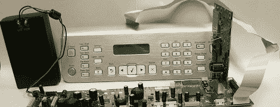

# 从打印机的 WiFi 卡上免费下载 Linux 电脑

> 原文：<https://hackaday.com/2012/06/09/free-linux-computer-from-a-printers-wifi-card/>

无论是使用 Kinect 构建 3D 扫描系统，还是使用 USB 电视调谐器加密狗进行软件无线电，商用硬件都有许多有趣的非计划用途。最新的成果来自于 sjMoquin 丰富的头脑和一个运行 Linux 的 Lexmark N2050 无线网卡。

这种构建始于一台 Lexmark X6570 多功能一体打印机，在易贝售价约为 100 美元。这台打印机附带一个运行 [BusyBox](http://www.busybox.net/) 的 Lexmark N2050 WiFi 卡。在 N2050 上的 USB/UART 引脚上焊接了一些电线之后，[sjMoquin]有了一台非常便宜但非常有用的运行 Linux 的单板计算机。

还有一些工作要做 N2050 上的 WiFi 和 USB 目前还不支持。[sjMoquin]和[Julia Longtin]正在致力于此，因此一种基于打印机 WiFi 卡的全功能嵌入式 Linux 板应该很快就会问世。你知道，也许是时候打电话给易贝要几张这样的卡片了。