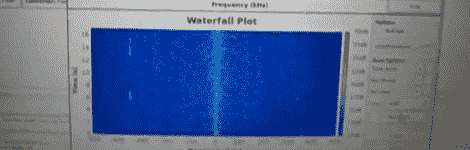

# [巴林特]正在启动一个软件定义无线电系列教程

> 原文：<https://hackaday.com/2012/06/11/balint-is-starting-a-software-defined-radio-tutorial-series/>

几个月前，我们看到了一个黑客，一个 20 美元的 USB 电视调谐器被改造成一个软件定义的无线电，能够读取 GPS 信号，收听飞机和控制塔之间的无线电传输，甚至是一个简单的 FM 无线电。这个项目是对 RTL-SDR 和 Ham 无线电场景的完美介绍，但是让这些项目启动和运行对于以前没有玩过这个的人来说可能有点难以承受。[巴林特]正在通过一系列 YouTube 教程来解决这个问题，让 SDR noobs 与 GNU Radio 和 Realtec USB 电视调谐器一起运行。

为了展示软件定义无线电的力量，[巴林特]正在使用 [GNU Radio](http://gnuradio.org/redmine/projects/gnuradio) 和启动这一切的 USB 电视调谐器 Ezcap EZTV668(方便的是在 DealExtreme 的[又有现货，但](http://www.dealextreme.com/p/mini-dvb-t-digital-tv-usb-2-0-dongle-with-fm-dab-remote-controller-92096?item=2)[还有其他选择](http://www.reddit.com/r/RTLSDR/comments/s6ddo/rtlsdr_compatibility_list_v2_work_in_progress/))。因为软件定义无线电对于初学者来说有点混乱，所以[巴林特]通过解释[无线电源、接收器和 GNU 无线电接口](http://www.youtube.com/watch?v=N9SLAnGlGQs)开始了他的教程系列。

[巴林特]已经发布了 5 个教程，并在他的 gr-baz 项目中提供了流程图文件。他在向初学者开放软件定义无线电领域方面做得非常出色，但他仍在寻求一些反馈。如果你对[巴林特]接下来应该报道什么有什么建议，请在 YouTube 评论中留言，我们相信[巴林特]最终会找到时间的。