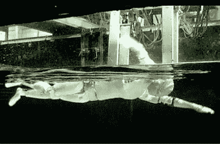

# Swumanoid:一个会游泳的人形机器人

> 原文：<https://hackaday.com/2012/06/11/swumanoid-a-swimming-humanoid-robot/>

如果你碰巧参加今年八月在台北举行的第五届国际空气水生物机制研讨会，你可能有机会看到这个半个大小的游泳人形机器人。Swumanoid 是由东京工业大学的研究人员通过对一个人进行 3d 扫描，然后简化形状并将其分解为 3d 可打印部分而创建的。防水马达是需要的…因为它是一个游泳机器人。发音相当令人难以置信，苏门鳄可以爬泳，就像你在下面的视频中看到的一样，也可以蛙泳、仰泳、蝶泳，甚至狗刨式。

[https://www.youtube.com/embed/e_Gp5h14KG4?version=3&rel=1&showsearch=0&showinfo=1&iv_load_policy=1&fs=1&hl=en-US&autohide=2&wmode=transparent](https://www.youtube.com/embed/e_Gp5h14KG4?version=3&rel=1&showsearch=0&showinfo=1&iv_load_policy=1&fs=1&hl=en-US&autohide=2&wmode=transparent)