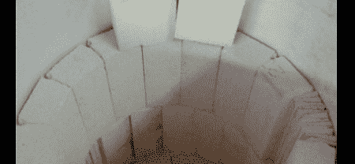

# 在你的后院建造一个铸造厂

> 原文：<https://hackaday.com/2012/06/12/building-a-foundry-in-your-backyard/>

【th3BadWolf】到现在已经有一段时间想建铸造厂了。如果做得好，这是一个非常简洁的工具；铸造铝铸件相当容易，如果你足够聪明，铸造厂可以制造大型机床，如车床或轧机。任何值得做的事情都值得做得过分，所以[BadWolf]正在设计他的铸造厂每 45 分钟熔化 150 磅铝。

这座建筑始于一个简陋油桶。[th3BadWolf]切掉桶的顶部，开始用陶瓷毯和耐火砖给桶的内部加衬。为了把这个有些不稳定的毯子和砖块组合在一起，[BadWolf]用 3000 华氏度的水泥把所有东西粘在一起。

熔炉的主体几乎完成了，但是[BadWolf]仍然需要为燃烧器系统钻几个洞。他会用丙烷开始每次燃烧，然后当炉子足够热的时候再用机油。这真是一个了不起的项目，我们迫不及待地想看到结果。