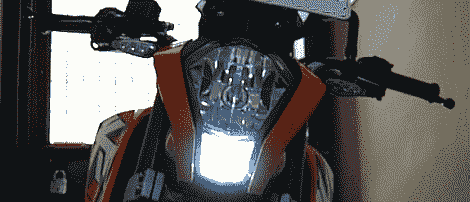

# 给摩托车装上苹果“会呼吸的 LED”

> 原文：<https://hackaday.com/2012/06/12/adding-the-apple-breathing-led-to-a-motorcycle/>

[spiralbrain]有一辆漂亮的 KTM 杜克 200 摩托车，但他发现工厂配置有点简单。为了给自己的自行车添加独特的风格，他决定给停车灯添加一个“呼吸 LED ”,它会慢慢改变亮度，就像最近 MAC 电脑上的 LED 一样。

从工厂来看，[spiralbrain]的自行车使用效率极低(有点难看)的 T10 灯作为停车灯。这是一个 12 伏的白色 SMD 灯泡，但真正使这个建筑特别的是[spiralbrain]控制这个灯的方式。

[spiralbrain]增加了一个非常小的电路，由一个 8 引脚微控制器(PIC12F683)组成，使用内置的 PWM 模块慢慢地调暗新的 SMD 灯泡。当自行车脱离空档时，微控制器停止在最高 PWM 设置，因此“呼吸”LED 功能仅在不移动时启用。

这是一个有趣的模型，当[spiralbrain]展示他的自行车时，肯定会引起一些注意。作为一个奖金，国防部是完全可逆的，所以自行车的保修仍然是好的。