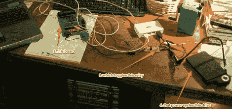

# 在一个非常不安全的硬盘上强行输入密码

> 原文：<https://hackaday.com/2012/06/13/brute-forcing-the-password-on-a-terribly-insecure-hard-drive/>

有一天在工作时，[Marco]被一位拿着便携式 USB 硬盘的同事找到。这款硬盘是 Freecom ToughDrive，内置安全系统，每次安装硬盘时都需要输入密码。不出所料，这个硬盘上的密码丢失了，所以[Marco] [蛮力破解了这个硬盘](http://blog.thinkst.com/2012/06/lamest-hacks.html)上的密码。

无论何时插入硬盘，Freecom ToughDrive 都需要输入密码，但只允许尝试 5 次，然后才需要重启。输入密码很容易实现自动化，但在五次尝试失败后，仍然存在拔出驱动器的问题。[Marco]要求他的朋友[Alex]制作一个小型 USB 延长线，将继电器插入 5 V 线路。一个足够简单的解决方案，之后唯一需要的就是时间来破解密码。

该设备在 500 次尝试后，或者在循环供电 100 次后，成功猜出了密码。对于通过暴力获取密码来说，这个数字低得令人难以置信，但话说回来，硬盘的所有者在某种程度上是可以预测他们使用什么密码的。