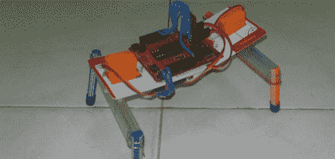

# 带 TI 发射台的双电机步行机器人

> 原文：<https://hackaday.com/2012/06/13/two-motor-walking-robot-with-a-ti-launchpad/>

上个月，[Vinod]心血来潮买了一对业余爱好伺服。这些伺服系统被搁置了一段时间，直到[Vinod]问他的朋友应该用它们来做什么。[Achu]建议将伺服系统用于步行机器人，因此在 YouTube 上查看了一些伺服驱动步行器的视频后，[Vinod][建造了自己的](http://blog.vinu.co.in/2012/06/two-servo-walking-robot-using-ti.html)。

该机器人是围绕 TI Launchpad 构建的，该 Launchpad 包含 MSP430 微控制器。一个非常简单的电路(只有一些伺服系统和一个盖子)通过改变伺服系统的转向来驱动机器人前进。

[Vinod]的双伺服移动机制很容易让人想起[光束机器人](http://www.beam-wiki.org/wiki/Main_Page)，这是由几个逻辑电路组成的极其简单的行走(或滚动)机器人。这个 TI Launchpad 在某些方面甚至更简单；[马克·蒂尔登]的[随身听机器人](http://www.beam-wiki.org/wiki/Tilden%27s_Vbug_1.5_/_Walkman_1.0)使用了几个 74 系列八进制缓冲器，[维诺德]的项目只是一个 Lanuchpad 和一对伺服系统。

所有的代码都可以在[Vinod]的博客上找到。休息后请观看演示视频。

[https://www.youtube.com/embed/jZtFp__QuTc?version=3&rel=1&showsearch=0&showinfo=1&iv_load_policy=1&fs=1&hl=en-US&autohide=2&wmode=transparent](https://www.youtube.com/embed/jZtFp__QuTc?version=3&rel=1&showsearch=0&showinfo=1&iv_load_policy=1&fs=1&hl=en-US&autohide=2&wmode=transparent)