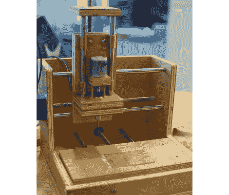

# 尾数 9 PCB 工厂

> 原文：<https://hackaday.com/2012/06/13/mantis9-pcb-mill/>

这是[尾数 9 PCB 厂](http://makeyourbot.org/mantis9-1)。这是我们第一次介绍这个项目，但它已经被一些人所熟知，因为它不断出现在其他数控加工厂项目的评论中。是的，它是由木头制成的——有些人不喜欢——但我们对建造说明和特别是价格标签(零件低至 85 美元)感到满意。

我们在 2010 年推出了硬件的早期版本[。随后的版本改变了框架，使用了开放式的设计，但是最大的改进是构建技术。问题是让平行杆的孔准确对齐。最终，一个简单的操作就解决了问题；将两块板夹在一起，同时钻孔。钻床用于所有的制作，确保孔垂直于板的表面。从那里，棒被赋予一些青铜衬套，并被压入到位。只有这样，平台才能用环氧树脂固定在套管上。这是为了确保衬套不会因对齐不良而卡住。我们认为它最终会比其他使用抽屉滑轨的](http://hackaday.com/2010/06/21/100-cnc-mill/)[版本少一些戏份。](http://hackaday.com/2011/11/11/150-cnc-mill-is-a-tad-slow-but-very-solid/)

休息后检查剪辑中的 PCB 铣削运行。

[https://www.youtube.com/embed/nlDpZl-QIAA?version=3&rel=1&showsearch=0&showinfo=1&iv_load_policy=1&fs=1&hl=en-US&autohide=2&wmode=transparent](https://www.youtube.com/embed/nlDpZl-QIAA?version=3&rel=1&showsearch=0&showinfo=1&iv_load_policy=1&fs=1&hl=en-US&autohide=2&wmode=transparent)

[谢谢哈维]