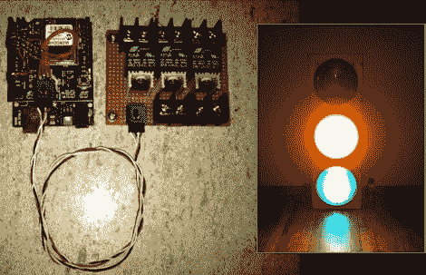

# 交通信号控制器通过 WiFi 获取数据

> 原文：<https://hackaday.com/2012/06/13/traffic-signal-controller-pulls-data-over-wifi/>

【Travis Brown】刚刚发表了[一篇关于他打造的红绿灯控制器](http://www.xodustech.com/projects/trafficlight)的帖子。他的头号目标是让设备无线化(除了交流电源)，他通过为他的 Arduino 使用 WiFi 盾实现了这一目标。但也有一个单独的板，为芯片提供了一种切换交流电灯的方法。

他为一家虚拟主机公司工作，老板想要一种有趣的方式来显示服务器的状态和其他事情。他选择使用 WiServer 库，该库控制着 CoperHead WiFi 盾，使他能够从 Arduino 提供简单的网页。当电源接通时，草图自动连接到 AP，并开始轮询公司的 API 以获取状态数据。如果你不在红绿灯的视线范围内，你可以登录到网络服务器来查看。

我们认为[Travis]在解释他的代码方面做得很好，我们为他恰当地使用了看门狗定时器(这是我们在很多项目中都没有看到的)而鼓掌。这加入了我们在这里看到的那堆[交通灯显示装置](http://hackaday.com/2012/02/12/monitoring-software-builds-with-a-traffic-light/)。我们仍然不知道人们是从哪里得到这些东西的。

[https://www.youtube.com/embed/oduCPl9G1CU?version=3&rel=1&showsearch=0&showinfo=1&iv_load_policy=1&fs=1&hl=en-US&autohide=2&wmode=transparent](https://www.youtube.com/embed/oduCPl9G1CU?version=3&rel=1&showsearch=0&showinfo=1&iv_load_policy=1&fs=1&hl=en-US&autohide=2&wmode=transparent)