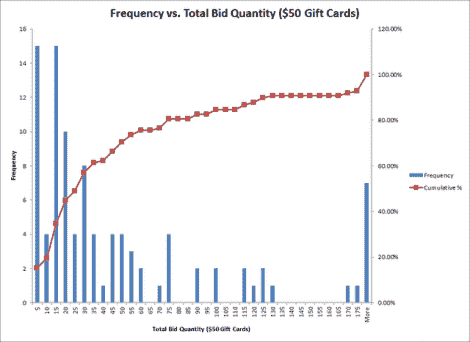

# 便士拍卖黑客；戴上你的统计学家的帽子

> 原文：<https://hackaday.com/2012/06/14/penny-auction-hacking-put-on-your-statisticians-hat/>

便士拍卖是你每次出价都必须支付费用的地方。当然，这改变了投标人的行为，但似乎没有太多关于具体如何改变的信息。为了准备一个分析学位，[Jay] [决定研究 penny auctions](http://pennystats.blogspot.com/2012/04/first-post-in-what-could-be-quite.html) ，看看他是否能根据他的发现赢得一场比赛。现在，他不一定想通过玩拍卖系统来谋生。但是我们很想知道他是如何获取信息的，以及他对结果有什么看法。

由于确实没有大量可用的数据，他自己搜集了这些数据。你会想浏览他关于这个话题的帖子，但是基本上他是在一台快速的机器上使用 Python 的。通过使用 [Selenium RC](http://seleniumhq.org/projects/remote-control/) ，这变得容易多了，但这也意味着他有很多 Firefox 实例运行来跟踪多个拍卖。抓取的数据存储在 CSV 文件中，并每天发布到他的首页。

根据他目前掌握的情况，[Jay]建议，一天中的时间、拍卖的类型和其他几个因素决定了你应该何时出价以获得最佳交易。