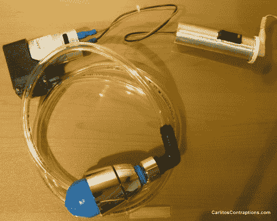

# 超级容易制造的夹紧夹

> 原文：<https://hackaday.com/2012/06/15/jamming-gripper-thats-super-easy-to-build/>

这是我们见过的最简单版本的卡住抓爪。唯一可能不容易得到的组件是左上角的泵，但其余的都是硬件或杂货店的东西。这是基于[的概念，我们从一个研究视频](http://hackaday.com/2010/10/26/robot-gripper-uses-coffee-to-pick-up-anything/)中看到，装满咖啡渣的膀胱中的空气被移除以抓住一个项目。在这种情况下，膀胱是一个派对气球，由一个便宜的淋浴喷头的部件固定在适当的位置。一个附加到倒钩的直角连接器可以很容易地将乙烯管连接到泵上。

休息后的视频显示，这对于小件物品非常有效。但是我们看到施加了很多向下的力来将它们牢牢地嵌入地面。我们不确定这是否是意料之中的事，或者如果一开始膀胱里有更多的空气，效果会不会好一点。这个[另一个卡住的手爪制造](http://hackaday.com/2011/01/25/jamming-gripper-completes-robot-drug-dealer/)使用一个伺服系统来释放系统的压力，我们认为这可能在这里也有帮助。

[https://www.youtube.com/embed/q7aoMQveHGc?version=3&rel=1&showsearch=0&showinfo=1&iv_load_policy=1&fs=1&hl=en-US&autohide=2&wmode=transparent](https://www.youtube.com/embed/q7aoMQveHGc?version=3&rel=1&showsearch=0&showinfo=1&iv_load_policy=1&fs=1&hl=en-US&autohide=2&wmode=transparent)

[谢谢迈克尔]