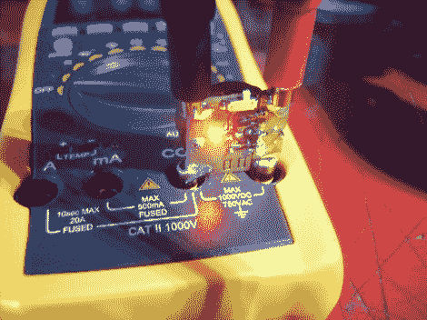

# 万用表附件让你测量微小的电阻值

> 原文：<https://hackaday.com/2012/06/15/multimeter-add-on-lets-you-measure-tiny-resistance-values/>

这个[万用表附件被称为半欧姆](http://jaanus.tech-thing.org/half-ohm/half-ohm-milliohm-adapter/)。它允许您测量小电阻值，并可用于追踪 PCB 上的短路。

该板充当两个探针的通道。当您的仪表设置为测量电压，并且没有任何东西连接到探针时，显示器将读出为附加装置供电的硬币电池的电平。当你探测时，毫伏值实际上显示的是毫欧电阻。这适用于任何小于 1 欧姆的测量。有趣的是，这将有助于你在一个焊接桥零。通过探测两条短路的走线，您可以根据下降的电阻值找到问题所在。

[Jaanus]发表了几篇文章，导致了最终版本的董事会。如果你有兴趣阅读的话，可以看看他博客的分类链接。