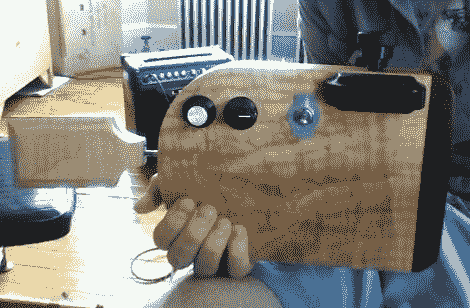

# 新的和改进的专利

> 原文：<https://hackaday.com/2012/06/18/new-and-improved-potentar/>

我们喜欢我们所看到和听到的[道林·达蒙的]最新版本的潜力。这是我们在 12 月的链接帖子中看到的[的 2.0 版本。他称之为 Potentar，因为它使用线性电位计，类似于吉他上的品的工作方式(电位计+吉他= Potentar)。](http://hackaday.com/2011/12/11/hackaday-links-december-11-2011/)

您应该注意的第一件事是 case 升级。原来的使用什么看起来像未完成的废木材，但成品木材的情况下，真的使事情看起来像一个传统的工具。通过这种设计，他放弃了 Arduino，转而使用独立的 ATmega328 芯片。你会注意到身体正面的旋钮和开关。这允许选择几个不同种类的秤并关闭电源。线性电位计和缝纫机按钮与之前相同。休息之后，你可以听到他的描述和快速的表演，这要感谢音频插孔将其连接到放大器上。

[https://player.vimeo.com/video/43608978](https://player.vimeo.com/video/43608978)