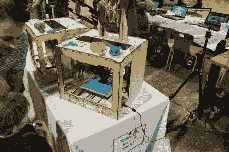

# 2012 年数控展:机床和 3D 打印机

> 原文：<https://hackaday.com/2012/06/24/nc-maker-faire-2012-machine-tools-and-3d-printers/>

今年的 NC Maker Faire 上有相当多的 3D 打印机(如[【fab licator】](http://www.fablicator.com/ "Fablicator")、几台[【RepRap】](http://reprap.org/wiki/RepRap "RepRap")和 [MakerBot](http://www.makerbot.com/ "Makerbot") )以及一些减法加工设备，包括一台木工车床、[【ShopBot】](http://www.shopbottools.com/ "shopbot")显示器(赞助商之一)和我的小 [CNC 路由器](http://www.jcopro.net/2012/06/14/a-paint-stencil-with-pcb-board-blanks-and-a-cnc-router/ "CNC router making stencil for NC maker Faire")。甚至有一个小小的[【egg bot】](http://egg-bot.com/ "eggbot")展出，它将几个 CNC 概念结合到一个真正独特的设备中，用于在鸡蛋上打印图片。

查看下面的视频，了解在[展会](http://makerfairenc.com/ "NC Maker Faire 2012")上发生了什么。3D 打印或数控加工的爱好者总会有更多的空间，所以希望它能激励一些制造商扩展他们的能力！T3T5