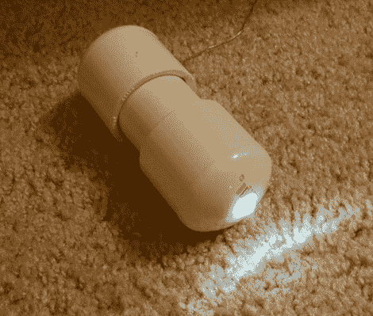

# 迷你防水 LED 灯充电无电线

> 原文：<https://hackaday.com/2012/06/19/mini-waterproof-led-lanterns-charge-without-wires/>

如果你在寻找一个经得起风吹雨打的手电筒，或者只是在寻找一种简单的方法来为炎热的夏夜打扮你的游泳池，看看这些[可充电 PVC LED 灯。](http://www.designnews.com/author.asp?section_id=1362&doc_id=245321)受到《制造:杂志》上一篇关于[坚不可摧的 LED 灯](http://makeprojects.com/Project/Eternal-Flame-Indestructible-LED-Lantern/2092/1)的帖子的启发，【约翰·达菲】决定将该项目向前推进一步。

虽然他喜欢 Make 的防水灯笼，但他认为最好是永久密封灯，以获得最大的耐用性。他不满足于一次性使用的灯，他给 PVC 灯配备了一节可充电 AA 电池、驱动 LED 的升压电路和感应充电线圈。

他的漂浮防水灯比他们的前辈稍微大一点，以容纳额外的电子设备，但我们认为这是一个公平的交易，因为它们可以无线充电。

现在就下您的 Digikey/Mouser/Jameco 订单，并查看[John 的]操作视频——您可能会在周末得到一些内置的！

[via [HackedGadgets](http://hackedgadgets.com/2012/06/18/diy-wirelessly-charging-led-light-made-from-pvc-plumbing-parts)

<object id="myExperience" class="BrightcoveExperience"><param name="bgcolor" value=""> <param name="width" value="470"> <param name="height" value="412"> <param name="playerID" value="991410168001"> <param name="@videoPlayer" value="1678050992001"> <param name="playerKey" value="AQ~~%2CAAAAAETaO0s~%2CcVbOypIs9tHUVW57d5nJxZGxNa9O_LLK"> <param name="isVid" value="1"> <param name="isUI" value="1"> <param name="dynamicStreaming" value="true"> <param name="autoStart" value="false"> <param name="secureConnections" value="true"> <param name="secureHTMLConnections" value="true"></object>