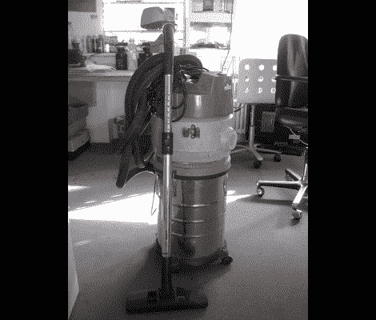

# 组装两台商店吸尘器

> 原文：<https://hackaday.com/2012/06/19/hacking-together-two-shop-vacuums/>

不幸的是，将两台商店吸尘器组装在一起的结果并不是一个双动力的怪物。这实际上是[将破损和不合格的零件组合成一台可用的机器](http://shackspace.de/?p=3209)的故事。Shackspace 的伙计们最初买了一台便宜的商店吸尘器，它的马达太快停止了运转。替代者只有一个装垃圾的小容器。所以他们做了任何黑客空间成员都会做的事情，将两者结合起来。

因为他们想从破损的真空中使用体积庞大的外壳，所以第一项工作就是拆除损坏的马达组件。用旧烙铁熔化掉塑料，很快就完成了这项工作。然后用螺钉将小型机器的电机组件安装到位，并用填缝剂密封。多亏了从其他丢失已久的真空吸尘器中抢救出来的软管和附件，它现在可以工作了。

但如果他们就此打住，这可能会是一次无聊的黑客攻击。该团队在顶部增加了一个墙壁插座，并用由壁式电源供电的 RGB LEDs 灯装饰这只野兽(因此增加了墙壁插座)。不使用时，它可以兼作情绪灯。

[谢谢莫莫]