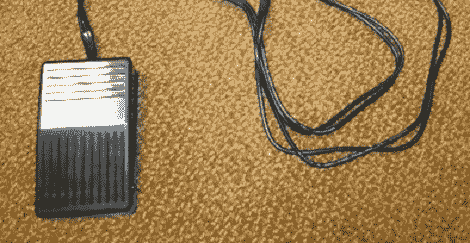

# 为 Vim 打造离合器

> 原文：<https://hackaday.com/2012/06/21/building-a-clutch-for-vim/>

无论您使用 emacs、vi 还是 vim，由于无鼠标界面，您的手指都将在键盘上表演杂技。[alevchuk]认为他的脚可以用来减少击键次数，所以他制造了 vim 离合器。这是一个支持 USB 的脚踏板，可以在 vim 中的光标前插入字符。

Vim 要求用户键入字母“I”以在光标前插入文本。[alevchuk]认为这个功能可以很容易地被脚踏板复制，所以他找到了一个[非常便宜的 USB 脚踏板](http://www.pcsensor.com/index.php?_a=viewProd&productId=2)作为他的 vim 离合器。理想情况下，踏板应该在被踩下时发送“I ”,在松开时发送 Esc。【alevchuk】拿了两个踏板，编程一个发‘I’，一个发 Esc，放在同一个圈地里。

结果是在 vim 中光标之前插入一个工作离合器。[alevchuk]正在研究一种三踏板模型，以便在他的 vim 离合器的开始和结束位置添加插件，因此我们将密切关注他何时发布该构建。