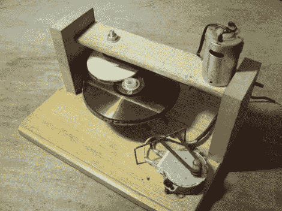

# CD/DVD 抛光机也许有一天会拯救你的备份

> 原文：<https://hackaday.com/2012/06/23/cddvd-polisher-may-save-your-backups-someday/>

CD 和 DVD 付费用户通常可以让音乐或电影继续播放，尽管会有一点擦伤。但是有时候你必须跳到下一章/曲目，否则播放器就会放弃。但是有了数据备份，一次刮擦就能破坏一整套文件。我们认为，大多数时候，这些令人头疼的问题可以用这个简单的抛光机来解决。

[Wotboa 的]旧货店发现了几乎所有制造该装置所需的部件。它由几个马达和一个夹具组成。一个马达缓慢旋转翻转的光盘，而另一个马达旋转抛光垫。该垫由毛毡挡风雨条制成，并辅以一些塑料抛光化合物。[Wotboa]声称，在这个嘈杂的装置中呆上五分钟，就能在任何光盘上创造奇迹。休息之后，你可以通过观看视频剪辑来了解它的能力。

[https://www.youtube.com/embed/kpkhOUs6nFg?version=3&rel=1&showsearch=0&showinfo=1&iv_load_policy=1&fs=1&hl=en-US&autohide=2&wmode=transparent](https://www.youtube.com/embed/kpkhOUs6nFg?version=3&rel=1&showsearch=0&showinfo=1&iv_load_policy=1&fs=1&hl=en-US&autohide=2&wmode=transparent)