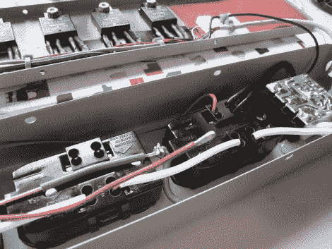

# DIY 微控制器开关电源板

> 原文：<https://hackaday.com/2012/06/23/diy-microcontroller-switched-power-strip/>

[Teknynja]正在寻找一种使用微控制器来控制几个分立交流供电设备的方法，虽然他确实考虑了 Adafruit 的[power switch tail 2](http://www.adafruit.com/products/268)，但处理 5 个设备会变得相当昂贵。他没有购买完整的现成解决方案，而是决定构建自己的 5 路开关插座。

他从当地五金店买了一个坚固的金属电源板，还有一些他在网上订购的夏普 S201S06V 继电器。在测试了电源板底盘内的继电器后，他连接了 6 个插座中的 5 个，以便通过微控制器进行切换。他将第 6 个插座配置为始终通电，为他计划用来切换其他插座的控制系统提供电源。

[Teknynja]从一个旧的 PS/2 鼠标上拔下连接器用作控制线，将一根线连接到每个继电器。他说，该条工作得很好，经过几个月的使用，它保持得很好。