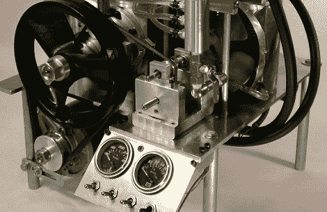

# 熔化啤酒罐和制造发动机

> 原文：<https://hackaday.com/2012/06/25/melting-beer-cans-and-building-engines/>

如果你有一个设备齐全的机械车间，并且厌倦了把旧啤酒罐拿到回收站，你会怎么做？如果你像[布洛克]一样，你可能最终会把那些罐子熔掉，去造一台发动机。

在收集了 50 磅啤酒罐并将它们熔化成各种大小的金属锭后，[布洛克]和他的公司有了大量的铝，却没有东西可以建造。最终，有人想出了用这些啤酒罐锭制造内燃机的主意。

到目前为止，啤酒罐发动机组已经用这些啤酒罐锭建造了两个发动机。[四冲程发动机](http://beercanengines.info/gallery/index.php?/category/1)最初是一个 5 英寸的铝立方体，经过钻孔和铣削加工成类似发动机缸体的东西。当[Brock]和啤酒罐发动机团队完成他们的四冲程杰作时，他们用一个 2 英寸的活塞取代了一个 150 毫升的水冷发动机。[二冲程发动机](http://beercanengines.info/gallery/index.php?/category/31)要简单得多，1 英寸缸径排量 19cc。

尽管没有任何信息涵盖用于将啤酒罐熔化成锭的陶器窑铸造厂，但这是一件令人惊叹的从头开始的工作建筑和引擎。

休息之后，你可以看看两个引擎的一些视频。

[https://www.youtube.com/embed/TKZ8p6GfktM?version=3&rel=1&showsearch=0&showinfo=1&iv_load_policy=1&fs=1&hl=en-US&autohide=2&wmode=transparent](https://www.youtube.com/embed/TKZ8p6GfktM?version=3&rel=1&showsearch=0&showinfo=1&iv_load_policy=1&fs=1&hl=en-US&autohide=2&wmode=transparent)
[https://www.youtube.com/embed/ElKrpndzmN0?version=3&rel=1&showsearch=0&showinfo=1&iv_load_policy=1&fs=1&hl=en-US&autohide=2&wmode=transparent](https://www.youtube.com/embed/ElKrpndzmN0?version=3&rel=1&showsearch=0&showinfo=1&iv_load_policy=1&fs=1&hl=en-US&autohide=2&wmode=transparent)
[https://www.youtube.com/embed/QzL4ntLqup4?version=3&rel=1&showsearch=0&showinfo=1&iv_load_policy=1&fs=1&hl=en-US&autohide=2&wmode=transparent](https://www.youtube.com/embed/QzL4ntLqup4?version=3&rel=1&showsearch=0&showinfo=1&iv_load_policy=1&fs=1&hl=en-US&autohide=2&wmode=transparent)