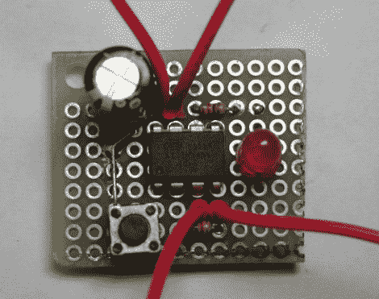

# 台式电源重置装置

> 原文：<https://hackaday.com/2012/06/25/bench-power-supply-resetting-thingy/>

在一些黑客中很常见的是，[亨利]重新利用了一个 ATX 电源单元作为测试电路板上测试电路的工作台电源(很像[这个奇特的例子](http://hackaday.com/2010/12/09/atx-psu-turned-into-an-adjustable-voltage-bench-supply/))。

然而，一些现代 PC PSUs 上的安全机制在过流保护启动后不会自动重置，这很快就让[Henry]感到恼火。为了让他的电源对黑客更友好，他用一些 [Arduino 库](http://www.arduino.cc/playground/Code/Bounce)连接并编程了一个 [ATtiny85V](http://www.atmel.com/devices/attiny85.aspx) ，为他做那件事。这个简单的项目是一个很好的例子，说明了如何使用黑客技术来改进现有的黑客技术。