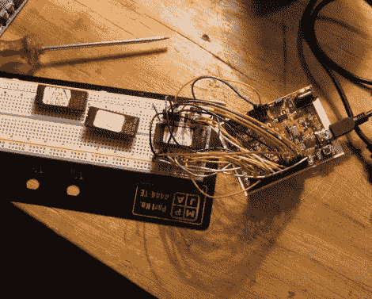

# 从一些旧的硬件中得到一个垃圾场

> 原文：<https://hackaday.com/2012/06/26/taking-a-dump-from-some-old-hardware/>

NYC Resistor 向您展示如何从垃圾箱中寻找电子产品的乐趣。他们的帖子叫做*抛弃的快乐* 鼓励你四处寻找更老的内存芯片，看看它们隐藏了这么多年。

他们搜寻的目标是 EPROM 芯片。注意单个的 E。这些是可擦可编程只读存储器芯片，早于在首字母缩写词前加上“电”的 EEPROM。你曾经用紫外光源来清除旧类型的记忆。事实上，我们不时会看到一些 EPROM 擦除器作为项目。这些东西应该不难找到，因为在 20 世纪 80 年代，它们作为廉价的存储方式很流行。

如果芯片顶部的石英窗口已经屏蔽了周围的紫外光，你仍然可以读取它们，这就像连接你的 Arduino 一样容易。有用吗？不完全是，但它仍然可以很好地与那些可能永远不会从垃圾箱中出来的东西进行交互。